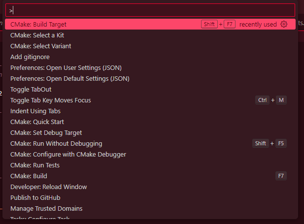
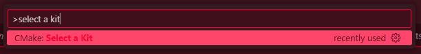
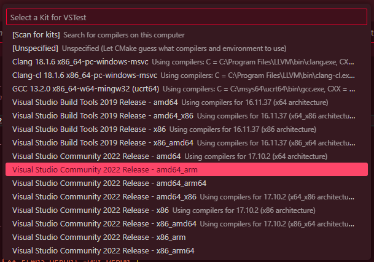
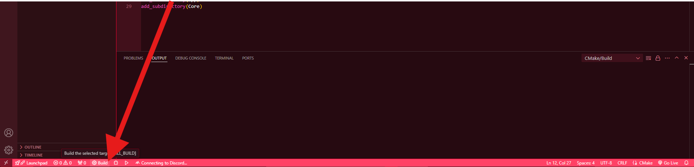
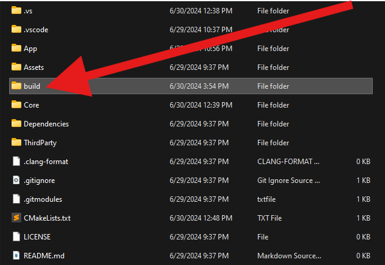
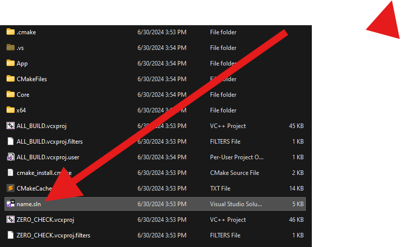
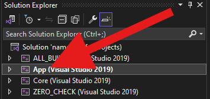
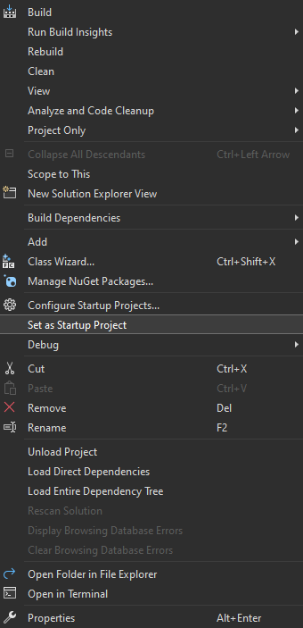

# App-Core Project Setup Creator
A collection of files and batch files to simplify the creation of a VSCode with an App/Core Architecture with a specialized batch file for c++ projects using Cmake.  
The created project can be used in Visual Studio.
> [!WARNING]
**THIS IS A COMMAND LINE TOOL THAT REQUIRES [VSCODE](https://code.visualstudio.com/download)**

> [!NOTE]
**This project is regularly updated to meet my needs so if you don't like something feel free to fork this and change it.**
# Setting up
You can download the repository in your desired location or clone the repository.
```
git clone https://github.com/some1hundred/VSCode-ProjectTools.git
```
and done! you may now use the scripts
## Adding to PATH
Add the VSCode-ProjectTools folder to the path with the following tutorials:
### Windows
[](https://www.youtube.com/watch?v=gb9e3m98avk)
# Usage
In this section the use of the tool is explained:
## Requirements
You will need [Visual Studio Code](https://code.visualstudio.com/download)  
And the following extensions  

- [CMake](https://marketplace.visualstudio.com/items?itemName=twxs.cmake)
- [CMake Tools](https://marketplace.visualstudio.com/items?itemName=ms-vscode.cmake-tools)  
## Creating the Project
If its on PATH already on your keyboard <kbd>⌘ Command</kbd> + <kbd>R</kbd> to open run on windows then write ```cmd``` and press <kbd>⏎ Enter</kbd> this will open the terminal and navigate to your desired location.  

**For the C++ Specialized Projects run**
```
Projc NameOfYourProject g
``` 
Replacing NameOfYourProject with the name you want to assign to it and g as an optional feature to include github files with it.     
  
**For Projects using any other languages run**
```
ProjType NameOfYourProject FileExtension g
```
 Replacing NameOfYourProject with the name you want to assign to, FileExtension with the file extension of your program and g as an optional feature to include github files with it.    
   
VScode will be opened automatically inside the folder if its on the path otherwise you can open it manually.
## C+ Projects with CMake
### Inside VSCode
Modifiy the files as you wish (you can change the name of the executable with the cmake list in the App folder).  
Press <kbd>⌃ Control</kbd> + <kbd>⇧ Shift</kbd> + <kbd>P</kbd>   
  
Type ```select a kit``` once the option appears press <kbd>⏎ Enter</kbd>  
  
Select your desired kit or scan for kits if none appear and repeat the previous steps.  
  
Build the project with the cmake tools buttons added on the lower right corner.  
  
### Using Visual Studio
After building with the Visual Studio kit open the generated build folder on the explorer  
  
Open the .sln file generated on the build folder with VS.  
  
Right Click on the App Project in the Solution Explorer  
  
Click on ```Set as startup project```  
  
